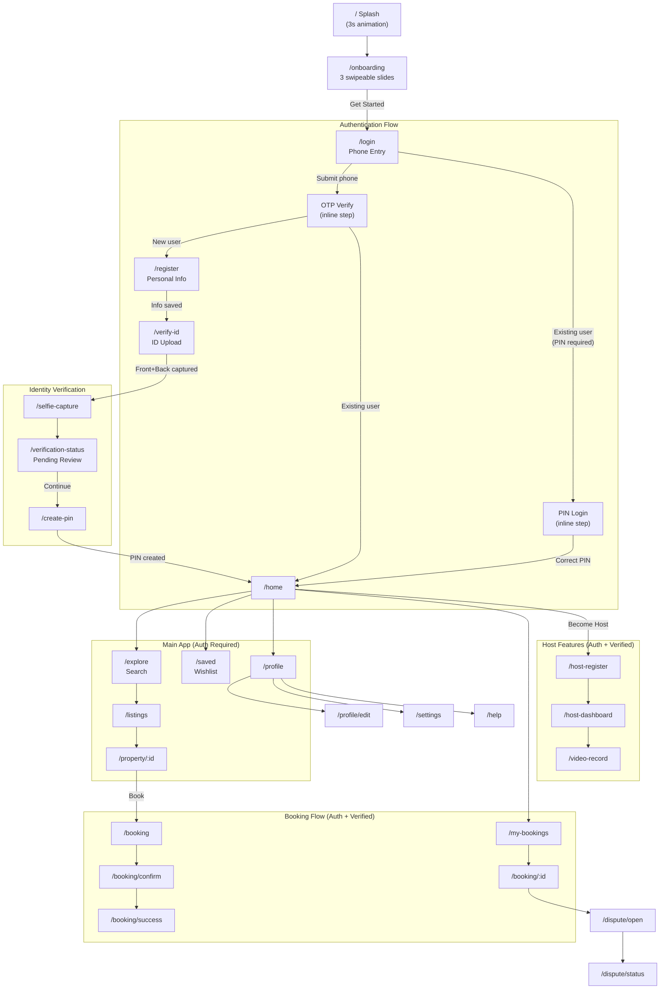
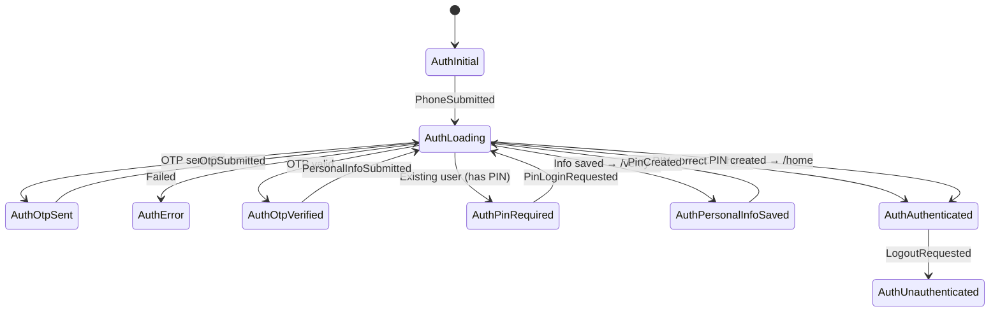

# NexaStays App Workflow & Navigation

## App Entry Point

```
main.dart → DI setup → AuthBloc provided globally → NexaStaysApp → GoRouter
```

Initial route: `/` (Splash)

---

## Complete Screen Flow



---

## Route Definitions

| Route | Path | Screen | Status |
|-------|------|--------|--------|
| **Splash** | `/` | [SplashPage](file:///c:/kol_chy/apps/nexastays/lib/features/splash/presentation/splash_page.dart#19-25) | ✅ |
| **Onboarding** | `/onboarding` | [OnboardingPage](file:///c:/kol_chy/apps/nexastays/lib/features/onboarding/presentation/onboarding_page.dart#25-36) | ✅ |
| **Login** | `/login` | [LoginPage](file:///c:/kol_chy/apps/nexastays/lib/features/auth/presentation/login_page.dart#18-24) | ✅ |
| **Register** | `/register` | [RegisterPage](file:///c:/kol_chy/apps/nexastays/lib/features/auth/presentation/register_page.dart#13-19) | ✅ |
| **Verify Phone** | `/verify-phone` | [VerifyPhonePage](file:///c:/kol_chy/apps/nexastays/lib/features/auth/presentation/verify_phone_page.dart#14-22) | ✅ |
| **Create PIN** | `/create-pin` | [CreatePinPage](file:///c:/kol_chy/apps/nexastays/lib/features/auth/presentation/create_pin_page.dart#13-21) | ✅ |
| **Verify ID** | `/verify-id` | `IdUploadPage` | ✅ |
| **Selfie** | `/selfie-capture` | `SelfiePage` | ✅ |
| **Verification Status** | `/verification-status` | `VerificationPendingPage` | ✅ |
| **Home** | `/home` | `HomePage` | ✅ |
| **Explore** | `/explore` | `SearchPage` | ✅ |
| **Listings** | `/listings` | `ListingsPage` | ✅ |
| **Property Detail** | `/property/:id` | `PropertyDetailPage` | ✅ |
| **Saved** | `/saved` | Placeholder | 🔲 |
| **Profile** | `/profile` | Placeholder | 🔲 |
| **Edit Profile** | `/profile/edit` | Placeholder | 🔲 |
| **Settings** | `/settings` | Placeholder | 🔲 |
| **Help** | `/help` | Placeholder | 🔲 |
| **Booking** | `/booking` | `BookingPage` | ✅ |
| **Confirm Booking** | `/booking/confirm` | `ConfirmBookingPage` | ✅ |
| **Booking Success** | `/booking/success` | `BookingSuccessPage` | ✅ |
| **My Bookings** | `/my-bookings` | `BookingsPage` | ✅ |
| **Booking Detail** | `/booking/:id` | `BookingDetailPage` | ✅ |
| **Open Dispute** | `/dispute/open` | Placeholder | 🔲 |
| **Dispute Status** | `/dispute/status` | Placeholder | 🔲 |
| **Host Register** | `/host-register` | `HostRegisterPage` | ✅ |
| **Host Dashboard** | `/host-dashboard` | `HostDashboardPage` | ✅ |
| **Video Record** | `/video-record` | Placeholder | 🔲 |

---

## Route Guards

Three guards run on **every** navigation in [router.dart](file:///c:/kol_chy/apps/nexastays/lib/app/router.dart):

| # | Guard | Condition | Redirect |
|---|-------|-----------|----------|
| 1 | **Auth required** | Not authenticated + not a public route | → `/login` |
| 2 | **Already authenticated** | Authenticated + going to `/login` or `/register` | → `/home` |
| 3 | **Verification required** | Authenticated but unverified + going to booking/host routes | → `/verify-id` |

### Public routes (no auth needed):
`/`, `/onboarding`, `/login`, `/register`, `/verify-phone`, `/create-pin`, `/verify-id`, `/id-capture`, `/selfie-capture`, `/verification-status`

### Verification-gated routes:
`/booking`, `/booking/confirm`, `/host-register`

---

## Auth BLoC State Machine



### Key states and their navigation triggers:

| State | Navigation Action |
|-------|------------------|
| [AuthOtpSent](file:///c:/kol_chy/apps/nexastays/lib/features/auth/presentation/bloc/auth_state.dart#24-36) | Show OTP input (inline in LoginPage) |
| [AuthOtpVerified](file:///c:/kol_chy/apps/nexastays/lib/features/auth/presentation/bloc/auth_state.dart#37-49) (new user) | `context.push('/register')` |
| [AuthOtpVerified](file:///c:/kol_chy/apps/nexastays/lib/features/auth/presentation/bloc/auth_state.dart#37-49) (existing) | `context.go('/home')` |
| [AuthPinRequired](file:///c:/kol_chy/apps/nexastays/lib/features/auth/presentation/bloc/auth_state.dart#61-71) | Show PIN keypad (inline in LoginPage) |
| [AuthPersonalInfoSaved](file:///c:/kol_chy/apps/nexastays/lib/features/auth/presentation/bloc/auth_state.dart#50-60) | `context.push('/verify-id')` |
| [AuthAuthenticated](file:///c:/kol_chy/apps/nexastays/lib/features/auth/presentation/bloc/auth_state.dart#83-93) | `context.go('/home')` |

---

## Transition Types

| Type | Duration | Used For |
|------|----------|----------|
| **Fade** | 200ms | Splash, Onboarding, Home tabs, Listings, Profile |
| **Slide Right→Left** | 250ms | Login, Register, Verify Phone, Create PIN, ID Verification |
| **Slide Bottom→Top** | 300ms | Booking flow (Book, Confirm, Success) |

---

## Feature Modules

```
features/
├── auth/                 # Phone login, OTP, PIN, registration
├── booking/              # Create booking, confirm, success, list, detail
├── dispute/              # Open disputes, status tracking
├── home/                 # Main home feed with listings
├── host_dashboard/       # Host management panel
├── host_onboarding/      # Become a host flow
├── identity_verification/# KYC: ID upload, selfie, pending status
├── onboarding/           # First-time user slides
├── profile/              # User profile management
├── property/             # Listings page + property detail
├── search/               # Search/explore functionality
├── splash/               # Animated splash screen
├── welcome/              # (unused/legacy)
└── wishlist/             # (placeholder)
```

---

## Key Files

| File | Purpose |
|------|---------|
| [main.dart](file:///c:/kol_chy/apps/nexastays/lib/main.dart) | App entry, DI setup, global BLoC providers |
| [router.dart](file:///c:/kol_chy/apps/nexastays/lib/app/router.dart) | All GoRouter routes, guards, transitions |
| [app_routes.dart](file:///c:/kol_chy/apps/nexastays/lib/navigation/app_routes.dart) | Centralised route path constants |
| [route_guard.dart](file:///c:/kol_chy/apps/nexastays/lib/navigation/route_guard.dart) | SessionManager-based guard (legacy, not currently used by router) |
| [auth_bloc.dart](file:///c:/kol_chy/apps/nexastays/lib/features/auth/presentation/bloc/auth_bloc.dart) | Auth state machine driving all auth navigation |
| [auth_state.dart](file:///c:/kol_chy/apps/nexastays/lib/features/auth/presentation/bloc/auth_state.dart) | All auth states |
| [auth_event.dart](file:///c:/kol_chy/apps/nexastays/lib/features/auth/presentation/bloc/auth_event.dart) | All auth events |
